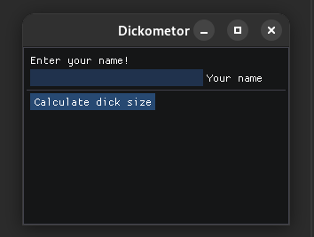
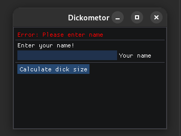
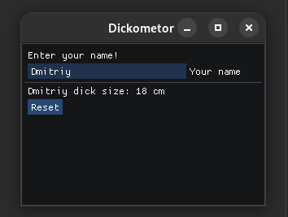

# Hello imgui
This is my test C++ project

## Screenshots

## Techniques
- C++
- [CMake](https://cmake.org)
- [ImGui](https://github.com/ocornut/imgui)
- [ImGui-Cmake](https://github.com/Pesc0/imgui-cmake)